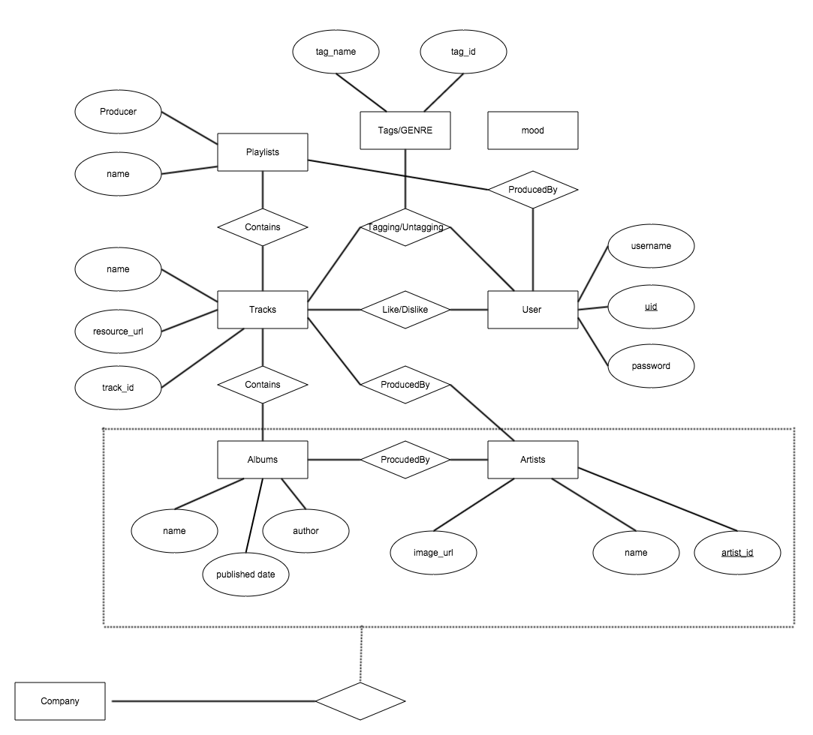

# DataBase Project: Music Recommender Part1 Proposal


### Authors

**Xiaochen Wei UNI:xw2353**

**Xuejun Wang UNI:xw2355**

### 0. Contents

This is the project 1 for COMS W4111

The Contents are:

* scripts: Python scripts that help us download the data from Spotify and Rovi.
* Written: Proposals, ER Map Demo and other written parts.
* NodeApp: The web application for part 3. We build our application with Express.js framework using Node.js.

Here are some screen shots of our web applications:

**Login**


**Tag-based music Recommendations：**


**Popular music Recommendations：**


### 1. High-level Description Of The Application

For project 1, we plan to build a music recommender database based on the data on [Spotify](https://developer.spotify.com/web-api/) and [Rovi](http://developer.rovicorp.com/docs) API. To achieve this goal, we will include entities like users, artists, albums, tracks, playlists, and metadata like moods or genres. The relationship sets will also be built accordingly. 

A web application will be implemented in part 3 to incorporate the following functionalities:
1. Once the user has signed up and login, we will show some hot artists or tracks for them to choose for the cold start part, thus we could build the user profile and store them. 
2. Based on the user records, we could recommend tracks, artists, playlists to the user once logged in.
3. we offer different playlists for the user according to moods or environments  as they wish.

#### Challenges:
1. To construct suitable database structure to describe the relationships between entities
2. To implement and optimize recommendation algorithm based on user profile (like/ dislike of artists, genre or mood)
3. To design a easy to use, esthetically pleasing web application interface.

#### Contingency Plan
Should there be any unexpected condition regarding the team formation and contribution effort down-sizing, the recommendation application can be down-graded to an multi-criteria music search application.

### 2. Entities Sets, Relationship Sets With Attributes And Constraints

The demo of the ER Map:

We plan the include the entities sets and relationship sets as following:

**Entities Sets:**

1. **Users**: User for the recommender application
2. **Songs**: The songs in our database for recommendations.
3. **Albums**: All of singers that has songs included in the songs library.
4. **Artists**: The author of albums and songs in our database.
5. **Playlists**: Personalized playlists created by Users.
6. **Company**: The publication organization for albums.
7. **Tags/Mood/Style**: Description elements for songs and albums. 

**Relationship Sets:**

1. **MixedBy**: Relationship between Users and Playlists
2. **LikedBy**: Relationship between Users and Songs
3. **Contains**: Relationship between (Albums, Songs) and (Playlists, Songs)
4. **Describes**: Relationship between (Tags/Mood/Style, Playlists), (Tags/Mood/Style, Songs), and (Tags/Mood/Style, Albums).
5. **ProducedBy**: Relationship between (Artists, Albums) and (Artists, Songs).
6. **Owns**: Relationship between Company and (Albums, Artists).



### 3. The Resources of data

For the dataset part, we want to make use the practical data in the real world instead of just generating random and worthless ones. We use the API from [Spotify](https://developer.spotify.com/web-api/) and [Rovi](http://developer.rovicorp.com/docs) to get the informations about artists, albums, tracks and metadata like moods and tags.

For now, parts of the data has been downloaded and stored in JSON format locally. We will import them into database after designing the structure and schema of the whole DB.


Here is a sample of the JSON-format data:

```
{
  "genres": [
    "teen pop"
  ],
  "name": "Miley Cyrus",
  "external_urls": {
    "spotify": "https://open.spotify.com/artist/5YGY8feqx7naU7z4HrwZM6"
  },
  "popularity": 86,
  "uri": "spotify:artist:5YGY8feqx7naU7z4HrwZM6",
  "href": "https://api.spotify.com/v1/artists/5YGY8feqx7naU7z4HrwZM6",
  "followers": {
    "total": 1159797,
    "href": null
  },
  "images": [
    {
      "url": "https://i.scdn.co/image/a43b45e1a4fb11d428a3e0018122d94829c821bd",
      "width": 1000,
      "height": 1254
    },
    {
      "url": "https://i.scdn.co/image/f942c1a103d2706643906c412bc5122a557f35ee",
      "width": 640,
      "height": 802
    },
    {
      "url": "https://i.scdn.co/image/94bcf3604205309e20adccf09a5534457992fc0c",
      "width": 200,
      "height": 251
    },
    {
      "url": "https://i.scdn.co/image/835259e06462618f2b7d3825d917db0a71cbef66",
      "width": 64,
      "height": 80
    }
  ],
  "type": "artist",
  "id": "5YGY8feqx7naU7z4HrwZM6"
}
```


### 4. How to run the code

before running the code, you sholud install node.js and some packages listed as following:

```
   "dependencies": {
    "ejs": "^2.3.1",
    "body-parser": "*",
    "express": "^4.12.3",
    "mysql": "*"
  }
```
After instalization, you could run the web application as following:

```
cd NodeApp

node server.js

```


